```{r setup, include=FALSE}
knitr::opts_chunk$set(echo = TRUE)
```

팀A 아이디어 제안서  

### 1. 야!여기어때?  
<br>

##### 1) 주제

**서울시 유동인구 자료를 분석하여 시간대별/주중 주말별 거리혼잡도를 예측하여 제공하는 시스템**

- 연령대/성별로 심화분석  
- 데이트 코스/관광 코스 추천  
- 구글 지역정보 분석을 통해 거리자체를 분류해줄수도 있음(술집거리/카페거리/공원/공연장주변 등)    
<br>

##### 2) 타깃 고객

- 관광/데이트 명소를 사람없는 시간대에 조용하게 둘러보고 싶은 사람들  
- 특정 연령/성별대가 많이 몰리는 곳에 가고싶은 사람들 ( ex)20대 여성이 많은 곳 )  
<br>

##### 3) 데이터 소스
  
- 서울시 열린 데이터 광장  
- 구글 api  
<br>

##### 4) 알고리즘
 
- 단순 분석  
- 가능하다면 각종 머신러닝 기법들(예측모델링)  
- 클러스터 분석  
<br>

 
##### 5) 수익창출모델
- 광고..  
- 유료어플화?  
<br>


##### 6) 예상 결과 시각화(레이아웃)
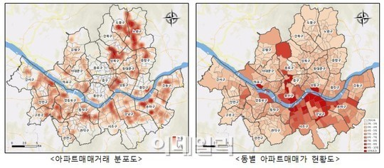{#id .class width="70%"}  
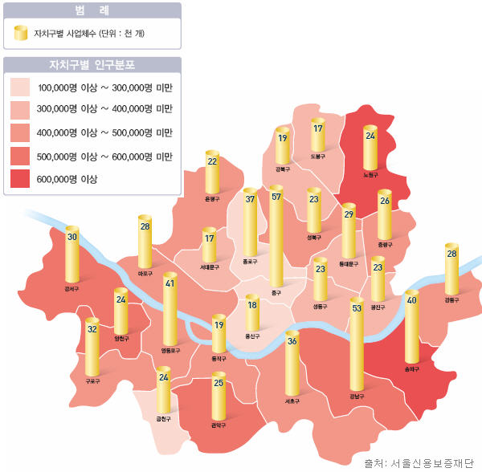{#id .class width="40%"} 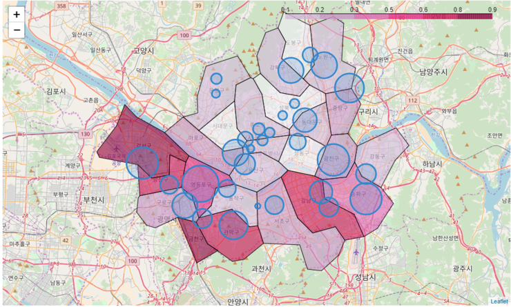{#id .class width="40%"}


<br>
서울시 지도에서 위젯으로 시간/주말 등을 선택한 후 혼잡도를 시각화

{#id .class width="30%"}  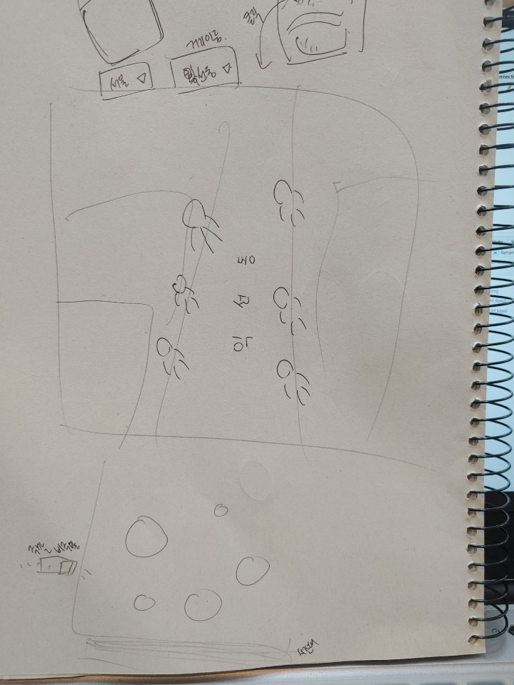{#id .class width="30%"} 

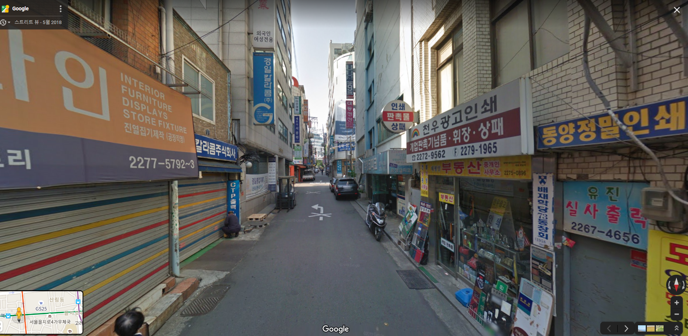{#id .class width="60%"}


그후 특정거리(street) 선택후 하이라이트 하여 거리뷰(크롤링)와 사람 실루엣(혼잡도를 시각화)을 합성  

<br>
<br>

### 2. 안경추천 시스템
<br>

##### 1) 주제

얼굴 이미지를 분석하여 사용자에게 가장 잘 어울리는 안경을 추천해주는 시스템 

- 비슷한 안경 클러스터링을 통해 
- 사용자의 얼굴을 분석하여 가장 이상적인 비율의 안경 추천
- 여러개의 후보를 제시하고 그 중 사용자가 가장 잘 어울린다고 판단한 안경 pick  
<br/>

##### 2) 타깃 고객

- 안경을 처음 구매하고자 하지만 어떤 안경이 잘 어울리는 지 모르는 사람들 
- 안경점에 직접 갈 시간이 없는 사람들
- 기존에 쓰던 안경 스타일을 바꿔보고 싶은 사람들 
=>부담없이 여러개의 안경을 써볼 수 있으며, 여러 안경점에 가야하는 수고를 줄이고 시간절약 가능  
<br>

##### 3) 데이터 소스
  
- 크롤링
- 네이버 api 얼굴인식 서비스   
<br>

##### 4) 알고리즘
 
- 이미지 클러스터링(SOM?)
- ??  
<br>

 
##### 5) 수익창출모델
- 광고 및 각종 안경점과의 협약
- 앱 내에서의 구매 기능  
<br>


##### 6) 예상 결과 시각화(레이아웃)

- 사용자가 본인의 사진을 올리면 아래의 안경 황금비율에 가장 맞는 안경을 여러개 추천해준다. 

<br>
{#id .class width="30%"}  {#id .class width="30%"}


- 아래와 같이 여러개의 예상 사진을 보여주고 사용자가 가장 마음에 들어하는 디자인을 고르게 한다. 
<br>

{#id .class width="20%"}  {#id .class width="20%"}  {#id .class width="20%"}  

- 고른 안경과 비슷한 종류의 안경 여러개를 추천해준다.  

< 안경1과 비슷한 안경들 > 
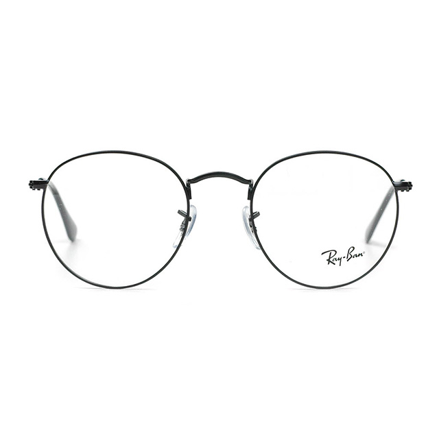{#id .class width="20%"}  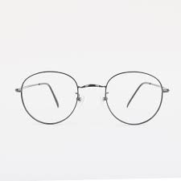{#id .class width="20%"}  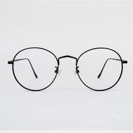{#id .class width="20%"} 


< 안경3과 비슷한 안경들 > 
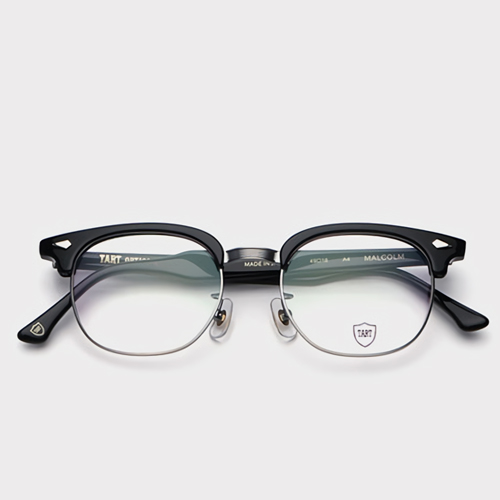{#id .class width="20%"}  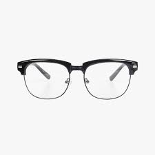{#id .class width="20%"}  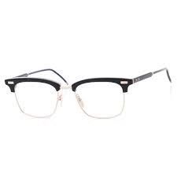{#id .class width="20%"}


### 3. 학식 추천 시스템

### 4. 취업 추천 

### 5. 학교 내 친구찾기 시스템 
